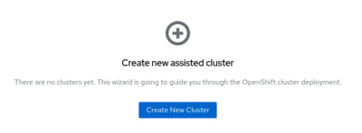
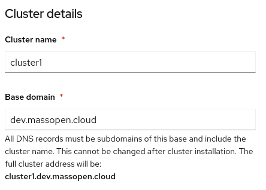
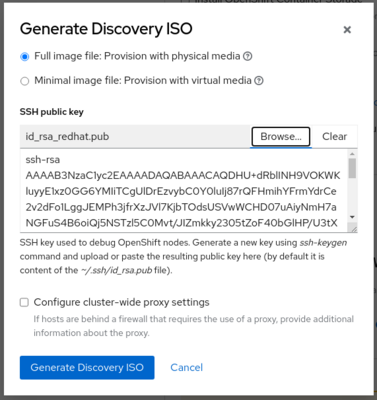
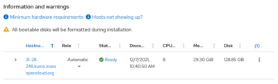
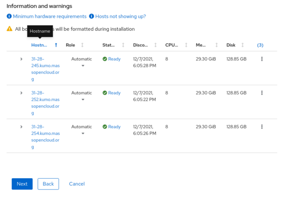
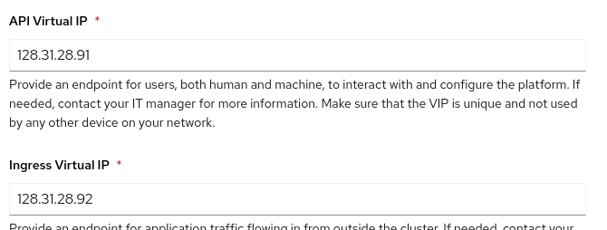
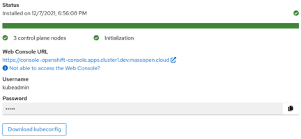

# Project 2: Installing OpenShift

The OpenShift [Assisted Installer][ai] is an installation tool that
makes it relatively simple to install and scale an OpenShift bare
metal cluster. We're going to be working with the Assisted Installer
service hosted at https://console.redhat.com, but this service can
also be self-hosted within your organization if you don't want to rely
on a third party.

## Pre-requisites

### Node requirements

The nodes that host the control plane for our OpenShift cluster
require:

- At least 4 CPU cores
- At least 16GB of RAM
- At least 120GB of disk space

### Infrastructure requirements

The assisted installer requires:

- That your hosts all live on the same network.
- That your hosts can acquire an IP address using DHCP
- That you have created DNS entries for the API endpoint and for the
  [default ingress controller][].

[ai]: https://cloud.redhat.com/blog/using-the-openshift-assisted-installer-service-to-deploy-an-openshift-cluster-on-metal-and-vsphere
[default ingress controller]: definitions.md#default-ingress-controller

Our virtual infrastructure will satisfy all the node requirements and
the first two infrastructure requirements, and I have created DNS
records that satisfy the last requirement.  Here's the API address:

```
$ dig +noall +answer api.cluster1.dev.massopen.cloud
api.cluster1.dev.massopen.cloud. 21 IN  A       128.31.28.91
```

And here's the default ingress address (and a demonstration of the
[wildcard DNS][] entry working):

[wildcard dns]: https://en.wikipedia.org/wiki/Wildcard_DNS_record

```
$ dig +noall +short something.apps.cluster1.dev.massopen.cloud
128.31.28.92
$ dig +noall +short anything.apps.cluster1.dev.massopen.cloud
128.31.28.92
```

## Starting the install

### Create the cluster

The Assisted Installer service is hosted at
https://console.redhat.com/openshift/assisted-installer/clusters.
Navigate there in your browser and click the "Create New Cluster"
button:



### Cluster details

On the next screen, we need to provide some information about this
cluster. The cluster name we've shown is `cluster1` (I know, it's not
terribly original), and the base domain is `dev.massopen.cloud`:



### Host discovery

You should now find yourself on the Host Discovery screen. This screen
allows us to generate an ISO image which we will use to boot our
virtual machines and register them with the installer.

Click the "Generate Discovery ISO" button. This will bring up a window
that allows you to enter an ssh public key that will be embedded in
the image. Paste your public key here (or click the "Browse…" button
and select it from disk), then click the "Generate Discovery ISO"
button.



You'll then be presented with the URL for the discovery image
(and a `wget` command line to download it).  Download the image to
`/var/lib/libvirt/images/discovery_img_cluster1.iso` (and click the
"Close" button on the "Generate Discovery ISO" window).

Now that we have the discovery image, we can start booting our virtual
nodes and registering them with the installer.

In our previous project, we created nodes attach to a virtual network.
They had relatively small amounts of memory and disk. We're going to
be making several changes to get our OpenShift cluster up.

We need sufficient memory and disk to meet the minimal node
requirements described above.  Experience suggests that the memory and
CPU requirements are optimistic, so we'll go with 30GB of memory and 8
VCPUS per node. Disk is a little trickier; the 120GB requirement is
fine, but for 3 nodes that requires 360GB of disk space, and if we
inspect our hypervisor...

```
$ df -h /
Filesystem      Size  Used Avail Use% Mounted on
/dev/sda1       220G   38G  171G  19% /
```

...we find that we don't have enough space available. In order to
provide sufficient disk space for our virtual nodes, we're going to
consume space provided by the MOC [Ceph][] storage cluster in the form
of [RBD][] devices.

[ceph]: https://www.redhat.com/en/technologies/storage/ceph
[rbd]: https://docs.ceph.com/en/pacific/rbd/

We will also need[^1] to attach the nodes to a public network so that
we end up with a cluster we can access from home.

[^1]: It's actually possible to set things up with the nodes attached
to the same private network we used in the previous project, but that
configuration ends up being a bit more complicated because we need to
arrange to proxy browser and API access into the internal environment.

Putting this all together, we get a `virt-install` command line that
looks something like this:

```
virt-install \
        -n $hostname \
        --memory 30000 \
        --os-variant rhel8.4 \
        --network bridge=br3803 \
        --disk pool=rbd,size=120 \
        --cdrom /var/lib/libvirt/images/discovery_image_cluster1.iso \
        --vcpu 8 \
        --cpu host-passthrough \
        --noautoconsole
```

In the above command line:

- `--network bridge=br3803` attaches our virtual machines to the
  `br3803` bridge device, which itself is attached to the
  `128.31.28.150/24` public network. Our machines will acquire
  addresses on this network using DHCP.

- `--disk pool=rbd,size=120` asks `virt-install` to allocate a 120GB
  disk from the `rbd` pool.

- `--cdrom /var/lib/libvirt/images/discovery_image_cluster1.iso`
  informs `virt-install` that we will be booting an installer from the
  named ISO file. The first time the virtual machine boots it will use
  this virtual CD-ROM device, but subsequent boots will use the hard
  drive.

Use the above command to create three nodes, named `node0.cluster1`,
`node1.cluster1`, and `node2.cluster1`. This would be a good time to
modify the `create-machines.sh` and `destroy-machines.sh` scripts you
wrote previously to quickly create and destroy the virtual nodes
required for this project.

As the nodes boot up, you should eventually see them registering with
the installer:



Once all the hosts have registered, you should be able to click the
"Next" button to move onto the next step:



### Networking

On the Networking screen we need to provide the two IP addresses we
discussed earlier (one for the API endpoint and one for the default
ingress controller). When you first get to this screen, the "Allocate
virtual IPs via DHCP server" box is checked. This causes OpenShift to
dynamically allocate addresses from the DHCP server. We want to
provide static addresses, since I have already created the necessary
DNS entries.

Place the API VIP (`128.31.28.91`) and the Ingress VIP
(`128.31.28.92`) in the appropriate fields:



Once you've set these two addresses you should be able to click the
"Next" button at the bottom of the screen and proceed to the final
step.

### Confirm and start the install

Click the "Install cluster" button to begin installing OpenShift on
the virtual nodes.

## Completing the install

During the install process, the installer will attempt to reboot the
nodes in our virtual cluster. Because of an implementation issue in
libvirt, the machines will power off instead of rebooting. You'll need
to start them up again when this happens, either by running `virsh
start <name>` on the command line or using `virt-manager`.

Once the installation has finished...



...you will be presented with the information necessary to log into
the cluster. You'll want to preserve two sets of credentials:

1. The `kubeadmin` password, which we will use to log into the
   console.
2. The `kubeconfig` file with administrative credentials.

## Logging in

### Logging in on the console

### Installing the command line tools

### Logging in on the command line

## Making a change with Kustomize

[cluster settings]: https://console-openshift-console.apps.cluster1.dev.massopen.cloud/settings/cluster
