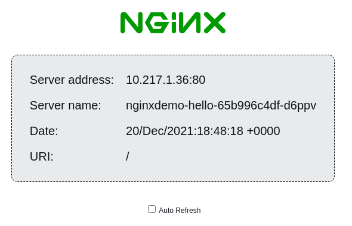

# Managing OpenShift with Kustomize

While there is a web UI for interacting with your OpenShift cluster,
in practice we generally use command line tools for making
configuration changes, deploying applications, and so forth. Before we
get started with some examples, make sure that you're authenticated to
your OpenShift cluster on the command line and that you're currently
active in the `default` [namespace][]:

[namespace]: https://kubernetes.io/docs/concepts/overview/working-with-objects/namespaces/

```
$ oc project default
```

## A simple application

To deploy a simple web server into OpenShift, we might start
with a [YAML][] manifest like this:

[yaml]: https://en.wikipedia.org/wiki/YAML

```
apiVersion: v1
kind: Pod
metadata:
  name: oauth-openshift-6d9dbdcbf9-g52rn
spec:
  containers:
  - name: hello
    image: docker.io/nginxdemos/hello
```

And then deploy it like this:

```
oc apply -f pod.yaml
```

This creates a single [pod][] (the basic unit of work in Kubernetes)
in the current namespace, running the `nginx` web server.  We can
check the status of the pod by running:

```
$ oc get pod
NAME                               READY   STATUS    RESTARTS   AGE
nginxdemo-hello                    1/1     Running   0          2m34s
```

And we can delete the pod like this:

```
$ oc delete pod/nginxdemo-hello
```

Or like this:

```
$ oc delete -f pod.yaml
```

(In general, anything you create using `oc apply` you can delete by
replacing `apply` with `delete` in the `oc` command line.)

## A minimally useful application

The previous example is unrealistic (for example, while you have a web
server running, you have no way to access it); in practice, we never deploy a
standalone pod like this. A typical application will minimally require
the following resources:

- A [Deployment][], which is responsible for managing one or more pods
  (starting them up, restarting them if they fail, or scaling them if
  applicable)
- A [Service][], which is how we expose network services in a
  structured fashion,
- A [Route][], which is an OpenShift-specific mechanism to expose the
  Service on a public endpoint (standard Kubernetes uses [Ingress][]
  resources to accomplish the same thing).

[deployment]: https://kubernetes.io/docs/concepts/workloads/controllers/deployment/
[service]: https://kubernetes.io/docs/concepts/services-networking/service/
[pod]: https://kubernetes.io/docs/concepts/workloads/pods/
[route]: https://docs.openshift.com/container-platform/4.9/networking/routes/route-configuration.html
[ingress]: https://kubernetes.io/docs/concepts/services-networking/ingress/

You'll find the necessary manifests to deploy our sample web server in
the [examples/1](examples/1) directory:

```
$ tree examples/1
examples/1/
├── deployment.yaml
├── route.yaml
└── service.yaml
```

We can deploy those into the current namespace using the `oc` command:

```
$ oc apply -f examples/1
```

In the above command, we're passing a directory to `oc apply` instead
of a single file; `oc` will deploy all the manifests in the named
directory.

Running `oc get pod` will now show us something like this:

```
$ oc get pod
NAME                               READY   STATUS    RESTARTS   AGE
nginxdemo-hello-65b996c4df-d6ppv   1/1     Running   0          12m
```

The pod in the above output was created by the deployment. If you were
to delete the pod (by running, in this case, `oc delete
pod/nginxdemo-hello-65b996c4df-d6ppv`), a new pod would be created to
replace it.

Let's inspect the Route we created:

```
$ oc get route
NAME              HOST/PORT                                         PATH   SERVICES          PORT   TERMINATION   WILDCARD
nginxdemo-hello   nginxdemo-hello-default.apps.dev.massopen.cloud          nginxdemo-hello   http                 None
```

The above information shows us that the web server we've deployed is
accessible at
<http://nginxdemo-hello-default.apps.dev.massopen.cloud>. Try visiting
that URL in your browser; you should see something like:



If you take a look at the manifests, you'll note we're making use of
[labels][labels and selectors] in a number of places. For example, the
Service uses labels in a `selector` element to identify the pods to
which it will direct traffic:

```
apiVersion: v1
kind: Service
metadata:
  name: nginxdemo-hello
spec:
  ports:
    - name: http
      port: 80
      targetPort: http
  selector:
    app: nginxdemo-hello
```

This will become relevant shortly as we discuss Kustomize. You can
read about this in more detail in the [Labels and Selectors][]
document.

Before moving on to the next section, delete the resources we just
created:

```
oc delete -f examples/1
```

[labels and selectors]: https://kubernetes.io/docs/concepts/overview/working-with-objects/labels/

## Why kustomize?

If we inspect the tags available for the [nginxdemo-hello container
image][], we see that there are two versions of the image available:
one that produces the "fancy" display we saw in the previous example,
complete with the nginx logo, and a second "plain text" version that
presumably only produces plain text. How would we deploy two versions
of our application, one using the plain version and one using the
fancy version:?

[nginxdemo-hello container image]: https://hub.docker.com/r/nginxdemos/hello/tags

The `oc` command makes it easy to deploy a directory full of
manifests, but when we want to make some changes it's not all that
flexible: our only option is to edit the files, which makes it
difficult to re-use things.

This is where [Kustomize][] comes in; it allows us to re-use manifests
by applying transformations to create our desired configuration
without needing to modify the original files.

You can download a standalone `kustomize` command from the [kustomize
releases][] page, but you can also take advantage of the fact that
support for Kustomize is build into the `oc` command. There are a few
advantages to using the standalone tool:

- If may have bug fixes and/or features not present in the `oc`
  command;
- It provides a convenient way to inspect the output of the
  kustomization process (running `kustomize build` just outputs the
  generated manifests on *stdout*);
- It comes with some handy cli tools for dealing with
  `kustomization.yaml` files

The following commands are generally equivalent:

```
oc apply -k some/directory
```

And:

```
kustomize build some/directory | oc apply -f-
```

Go ahead and grab kustomize version [4.4.1][] and install the
`kustomize` command somewhere in your `$PATH` (so that you can access
it by typing `kustomize` at the command prompt).

[4.4.1]: https://github.com/kubernetes-sigs/kustomize/releases/tag/kustomize%2Fv4.4.1

[kustomize]: https://kustomize.io/
[kustomize releases]: https://github.com/kubernetes-sigs/kustomize/releases

## Creating a kustomization file

We'll first create a project that deploys exactly the same thing we
deployed in the earlier example; once we have that working, we'll look
at how we can extend that to reach our goal of deploying two versions
of the service.

We'll start by creating a new directory (let's called it `example2`)
in which we will place a copy of the manifests from `examples/1`, and
then remove all of the label-related information (because we're going
to allow Kustomize to manage this for us).

That gives us the following manifests:

```
apiVersion: route.openshift.io/v1
kind: Route
metadata:
  name: nginxdemo-hello
spec:
  port:
    targetPort: http
  to:
    kind: Service
    name: nginxdemo-hello
```

```
apiVersion: v1
kind: Service
metadata:
  name: nginxdemo-hello
spec:
  ports:
    - name: http
      port: 80
      targetPort: http
```

```
apiVersion: apps/v1
kind: Deployment
metadata:
  name: nginxdemo-hello
spec:
  replicas: 1
  template:
    spec:
      containers:
        - name: hello
          image: docker.io/nginxdemos/hello:latest
          ports:
            - containerPort: 80
              name: http
```

Into this directory we'll place the following `kustomization.yaml`
file:

```
namespace: default

commonLabels:
  app: nginxdemo-hello

resources:
- deployment.yaml
- service.yaml
- route.yaml
```

That gives us the following layout:

```
example2
├── deployment.yaml
├── kustomization.yaml
├── route.yaml
└── service.yaml
```

A few notes about the above configuration:

- Whereas we were previously deploying things into "the current
  namespace", we've added an explicit namespace declaration into this
  `kustomization.yaml` file. This will cause all generated manifests
  to have a `namespace: default` setting in their metadata section, so
  regardless of which namespace is currently active, our resources
  will always deploy in the `default` namespace.

- The `commonLabels` directive (provided by the [labels
  transformer][]) instructs kustomize to add the specified labels to
  all generated manifests...but it does more than that. It also
  updates parts of manifests (like the `selector` on a Deployment or a
  Service) that reference those labels.

[labels transformer]: https://github.com/kubernetes-sigs/kustomize/blob/master/examples/transformerconfigs/README.md#labels-transformer

Run the following command (from inside the `example2` directory) to
inspect the manifests generated by Kustomize:

```
kustomize build | less
```

You'll note that our manifests now have consistent labelling, all
driven the by `commonLabels:` setting in the `kustomization.yaml`
file. For example, the `Deployment` looks like:

```
kind: Deployment
metadata:
  labels:                   # <-- labels added by kustomize
    app: nginxdemo-hello
  name: nginxdemo-hello
  namespace: default        # <-- namespace added by kustomize
spec:
  replicas: 1
  selector:                 # <-- selector added by kustomize
    matchLabels:
      app: nginxdemo-hello
  [...]
```

And the `Service` looks like:

```
apiVersion: v1
kind: Service
metadata:
  labels:                   # <-- labels added by kustomize
    app: nginxdemo-hello
  name: nginxdemo-hello
  namespace: default        # <-- namespace added by kustomize
spec:
  ports:
  - name: http
    port: 80
    targetPort: http
  selector:                 # <-- selector added by kustomize
    app: nginxdemo-hello
```

To deploy this into OpenShift, we could run (from inside the
`example2` directory):

```
oc apply -k .
```

And to clean things up afterwards:

```
oc delete -k .
```

You can find the files from this section in [examples/2](examples/2).

## Bases and overlays

Earlier I mentioned that Kustomize works by applying transformations
to existing manifests to produce new manifests. We've seen a little of
that in the previous example, where Kustomize added `namespace` and
labels to our resources.

We're going to take this a step further and use that feature to deploy
two versions of our example application.

Start by creating a new directory, `example3`. Inside that directory create a
`base` directory, and populate that with the content of the previous
section (that's `kustomization.yaml`, `deployment.yaml`, `service.yaml`,
`route.yaml`). Now create two additional directories, named `plain`
and `fancy`. At this point, you should have:

```
example3
├── base
│   ├── deployment.yaml
│   ├── kustomization.yaml
│   ├── route.yaml
│   └── service.yaml
└── overlays
    ├── fancy
    └── plain
```

### Fancy like

The "fancy" version of our service is going to be largely identical to
what we've already deployed, but we'll want to make a few changes to
avoid conflicts with other deployments in the same namespace.

First, we'll create a `kustomization.yaml` in the `fancy` directory
that references the original content in the `base` directory:

```
resources:
  - ../../base
```

If you were to run `kustomize build` in the `fancy` directory right
now, the output would be identical to running it from inside the
`base` directory.

We need to make two changes to avoid conflicts with other deployments:

- We would like to label resources with `nginx-hello-fancy` (instead
  of just `nginx-hello`), and
- We'd like all names to have a `-fancy` suffix

We can accomplish the first goal by adding a `commonLabels` directive
to our `kustomization.yaml`, giving us:

```
commonLabels:
  app: nginx-hello-fancy

resources:
  - ../../base
```

We can accomplish the second goal using the [prefix/suffix
transformer][] by adding a `namesuffix` directive to our
`kustomization.yaml`:

[prefix/suffix transformer]: https://github.com/kubernetes-sigs/kustomize/blob/master/examples/transformerconfigs/README.md#prefixsuffix-transformer

```
namesuffix: -fancy
commonLabels:
  app: nginx-hello-fancy

resources:
  - ../../base
```

At this point, you should have:

```
example3
├── base
│   ├── deployment.yaml
│   ├── kustomization.yaml
│   ├── route.yaml
│   └── service.yaml
└── overlays
    ├── fancy
    │   └── kustomization.yaml
    └── plain
```

You can go ahead and deploy this directory (run `oc apply -k .` from
inside the `fancy` directory). You'll find that all the resources get
created:

- The `Deployment` exists and has the expected name (and labels):

  ```
  $ oc get deployment
  NAME                    READY   UP-TO-DATE   AVAILABLE   AGE
  nginxdemo-hello-fancy   1/1     1            1           20s
  ```

- The `Pod` exists:

  ```
  $ oc get pod
  NAME                                    READY   STATUS    RESTARTS   AGE
  nginxdemo-hello-fancy-879ddcf95-pxkbz   1/1     Running   0          6m51s
  ```

- The `Service` exists:

  ```
  $ oc get service nginxdemo-hello-fancy
  NAME                    TYPE        CLUSTER-IP      EXTERNAL-IP   PORT(S)   AGE
  nginxdemo-hello-fancy   ClusterIP   172.30.37.204   <none>        80/TCP    7m36s
  ```

- And the Route exists:

  ```
  $ oc get route nginxdemo-hello-fancy
  NAME                    HOST/PORT                                                        PATH   SERVICES          PORT   TERMINATION   WILDCARD
  nginxdemo-hello-fancy   nginxdemo-hello-fancy-default.apps.cluster1.dev.massopen.cloud          nginxdemo-hello   http                 None
  ```

But if you attempt to access the service at
<http://nginxdemo-hello-fancy-default.apps.cluster1.dev.massopen.cloud>,
you'll receive the message:

> Application is not available
>
> The application is currently not serving requests at this endpoint.
> It may not have been started or is still starting.

What's going on?

### Fixing name references

When we modify the name of a resource (for example, by using
`namesuffix`), Kustomize uses the [name reference transformer][] to
update other resources that reference the renamed resource. This works
great for standard Kubernetes resources, because Kustomize has
built-in knowledge about what fields in these resources are resource
names.

As we mentioned [earlier](#a-minimally-useful-application), a `Route`
is an OpenShift-specific resource, which means Kustomize doesn't have
any special knowledge about it. If we examine the output of
`kustomize build` for our `fancy` overlay, we see that the generated
`Route` resource looks like this:

[name reference transformer]: https://github.com/kubernetes-sigs/kustomize/blob/master/examples/transformerconfigs/README.md#name-reference-transformer

```
apiVersion: route.openshift.io/v1
kind: Route
metadata:
  labels:
    app: nginx-hello-fancy
  name: nginxdemo-hello-fancy
  namespace: default
spec:
  port:
    targetPort: http
  to:
    kind: Service
    name: nginxdemo-hello
```

It's looking for a service named `nginxhello-demo`, but because of the
`namesuffix` configuration our service is named
`nginxdemo-hello-fancy`. The best way to fix this is by configuring
the name reference transformer such that it knows about the name
reference in the `Route` resource.

We need to make a couple of changes in the `base` directory to get
things working (we could make the changes in our overlay instead, but
in that case we'd need to do it once for each overlay; fixing it in
`base` means we only need to do it once).

In the `base` directory, edit the `kustomization.yaml` to include the
following directive:

```
configurations:
  - namereference.yaml
```

That gives us:

```
namespace: default
commonLabels:
  app: nginxdemo-hello

resources:
- deployment.yaml
- service.yaml
- route.yaml

configurations:
  - namereference.yaml
```

Create a new file `namereference.yaml` with the following content:

```
nameReference:
  - kind: Service
    fieldSpecs:
      - kind: Route
        path: spec/to/name
```

That tells Kustomize that `spec/to/name` in a `Route` resource refers
to a `Service` resource.

With these changes, you now have:

```
example3
├── base
│   ├── deployment.yaml
│   ├── kustomization.yaml
│   ├── namereference.yaml
│   ├── route.yaml
│   └── service.yaml
└── overlays
    ├── fancy
    │   └── kustomization.yaml
    └── plain
```

If we return to our `fancy` directory and run
`kustomize build` again, we see that the `Route` resource now has the
correct service name:

```
apiVersion: route.openshift.io/v1
kind: Route
metadata:
  labels:
    app: nginx-hello-fancy
  name: nginxdemo-hello-fancy
  namespace: default
spec:
  port:
    targetPort: http
  to:
    kind: Service
    name: nginxdemo-hello-fancy   # <-- service name is now correct
```

If you re-deploy this (`oc apply -k .`), you should see output like
this showing that the `Service` and `Deployment` resources remain
unchanged but the `Route` has been updated:

```
service/nginxdemo-hello-fancy unchanged
deployment.apps/nginxdemo-hello-fancy unchanged
route.route.openshift.io/nginxdemo-hello-fancy configured
```

You should now be able to visit
<http://nginxdemo-hello-fancy-default.apps.cluster1.dev.massopen.cloud> and
have it work successfully.

### Adding a second instance of the service

Let's work on the plain text version of our service. This is going to
be very similar to the `fancy` version, but we'll need to use a
the `plain-text` version of the `nginxdemox/hello` image.

Create a `kustomization.yaml` in the `plain` directory with the
following content:

```
namesuffix: -plain
commonLabels:
  app: nginx-hello-plain

resources:
  - ../../base

images:
  - name: docker.io/nginxdemos/hello
    newTag: plain-text
```

Here we're using the [images transformer][] to modify the image in our
`Deployment`. With this change, our project looks like:

[images transformer]: https://github.com/kubernetes-sigs/kustomize/blob/master/examples/transformerconfigs/README.md#images-transformer

```
example3
├── base
│   ├── deployment.yaml
│   ├── kustomization.yaml
│   ├── namereference.yaml
│   ├── route.yaml
│   └── service.yaml
└── overlays
    ├── fancy
    │   └── kustomization.yaml
    └── plain
        └── kustomization.yaml
```

If we run `kustomize build` in the `plain` directory, we should
see that the `image:` directive is using the new tag:

```
      containers:
      - image: docker.io/nginxdemos/hello:plain-text
```

Go ahead and deploy this directory. Once the corresponding pod is
running, you should be able to visit
<http://nginxdemo-hello-plain-default.apps.cluster1.dev.massopen.cloud/>
and see something like the following content:

```
Server address: 10.130.0.120:80
Server name: nginxdemo-hello-plain-84dd754477-bggtj
Date: 20/Dec/2021:22:19:18 +0000
URI: /
Request ID: 031db0b1a41c2bcf08a097790323b9de
```

### Deploy all the things

To make it easier to deploy both versions of the service, we can
create a `kustomization.yaml` file adjacent to the `base` directory
that looks like this:

```
resources:
  - overlays/fancy
  - overlays/plain
```

If we deploy from the this directory, it will deploy both versions of
the service:

```
$ ls
base kustomization.yaml overlays
$ oc apply -k .
service/nginxdemo-hello-fancy unchanged
service/nginxdemo-hello-plain unchanged
deployment.apps/nginxdemo-hello-fancy unchanged
deployment.apps/nginxdemo-hello-plain unchanged
route.route.openshift.io/nginxdemo-hello-fancy unchanged
route.route.openshift.io/nginxdemo-hello-plain unchanged
```

You can find the complete set of files from this section in the
[examples/3](examples/3) directory.

## A digression: ConfigMaps

A [ConfigMap][] is a Kubernetes resource that can store key/value
content. If you read through the linked documentation, you'll note
that there are [several ways to expose content from a ConfigMap to a
Pod][expose]:

[configmap]: https://kubernetes.io/docs/concepts/configuration/configmap/
[expose]: https://kubernetes.io/docs/tasks/configure-pod-container/configure-pod-configmap/

- You can expose all the keys in a `ConfigMap` as environment variables
- You can expose a single key in a `ConfigMap` as the value of a
  particular environment variable
- You can mount the content of a `ConfigMap` as directory on the
  filesystem, so that keys shows up as files.
- You can mount a single key from a `ConfigMap` as a file on the
  filesystem

Kustomize has several options for creating `ConfigMaps` via the
[`configMapGenerator` directive][configmapgenerator]. For example, if
we want to store a file named `index.html` in a ConfigMap named
`content`, we can add this to a `kustomization.yaml` file:

[configmapgenerator]: https://kubernetes.io/docs/tasks/manage-kubernetes-objects/kustomization/#configmapgenerator

```
configMapGenerator:
  - name: content
    files:
      - index.html
```

Assuming that `index.html`  contains the phrase `Hello world`, the
resulting ConfigMap will look like:

```
apiVersion: v1
data:
  index.html: |
    Hello world.
kind: ConfigMap
metadata:
  name: content-5b5mg9bhbf  # <-- note the hash suffix!
```

Note the name of the generated `ConfigMap`; it's not simply `content`,
but instead it is `content-<some random string>`. When Kustomize
generates `ConfigMaps`, it appends a string that is generated from a
hash of the content. This is used to automatically refresh
`Deployments` that are referencing the `ConfigMap`: when you re-deploy
the directory after making a change, any `Deployment` resources that
reference the `ConfigMap` named `content` will be updated to use the
new hash. This will cause any pods managed by the `Deployment` to be
re-created using the updated `ConfigMap`.

(A downside to this model is that you end up with a bunch of stale
`ConfigMaps` in your namespace, because the previous version isn't
automatically deleted when deploying a new version.)

## Patching things

Let's use the "mount the content of a `ConfigMap` as a directory"
behavior we mentioned in the previous section to deploy a version of
our example web server that displays our own content.

Create a new overlay named `newcontent` in the same directory tree you
used in the prior example, giving you something like:

```
example3
├── base
│   ├── deployment.yaml
│   ├── kustomization.yaml
│   ├── namereference.yaml
│   ├── route.yaml
│   └── service.yaml
└── overlays
    ├── fancy
    │   └── kustomization.yaml
    ├── newcontent              # <-- new directory here
    └── plain
        └── kustomization.yaml
```

In the new overlay directory, create a file named `index.html` with
content of your choice, and then create a `kustomization.yaml` file
that will deploy a `ConfigMap` containing this file along with the
`base` directory:

```
namesuffix: -newcontent
commonLabels:
  app: nginx-hello-newcontent

configMapGenerator:
  - name: content
    files:
      - index.html

resources:
  - ../../base
```

If you run `kustomize build` at this point, you'll see that the output
includes the `ConfigMap`. We need to configure the `Deployment` to
mount the `ConfigMap` at the appropriate location.

The way we insert arbitrary changes into a resource is by [patching][]
the resource with Kustomize.

[patching]: https://kubernetes.io/docs/tasks/manage-kubernetes-objects/kustomization/#customizing

Kustomize provides two mechanisms for patching resources:

- *Strategic merge patches* effectively merge the content of an update
  with the original YAML document.
- *JSONPatch* patches use the [jsonpatch][] language to describe
  changes to a document.

[jsonpatch]: http://jsonpatch.com/

In most cases, we prefer strategic merge patches because they are YAML
documents that follow the structure of the document being patched,
which makes them relatively easy to understand.

**NB**: See [this note](notes/patch-syntax.md) for more information
about patching syntax and some comments on the current state of the
documentation.

To mount a `ConfigMap` in our `Pod`, we need to add a `volumeMounts`
section to the container description in our `Deployment`, and we need
to add an additional `volumes` section after `containers`. We want the
final `Deployment` -- when it is deployed in OpenShift -- to look
something like this:

```
apiVersion: apps/v1
kind: Deployment
metadata:
  labels:
    app: nginx-hello-newcontent
  name: nginxdemo-hello-newcontent
  namespace: default
spec:
  replicas: 1
  selector:
    matchLabels:
      app: nginx-hello-newcontent
  template:
    metadata:
      labels:
        app: nginx-hello-newcontent
    spec:
      containers:
      - image: docker.io/nginxdemos/hello:latest
        name: hello
        ports:
        - containerPort: 80
          name: http
        volumeMounts:
        - mountPath: /usr/share/nginx/html
          name: content
      volumes:
      - configMap:
          name: content-newcontent-kk96m952t4
        name: content
```

Create a new file in our overlay directory named
`deployment_patch.yaml` with the following content:

```
apiVersion: apps/v1
kind: Deployment
metadata:
  name: nginxdemo-hello
spec:
  template:
    spec:
      containers:
        - name: hello
          volumeMounts:
            - name: content
              mountPath: /usr/share/nginx/html
      volumes:
        - name: content
          configMap:
            name: content
```

And add an appropriate section to the `kustomization.yaml` to
reference the patch:

```
patches:
  - path: deployment_patch.yaml
```

At this point, you should have:

```
example3
├── base
│   ├── deployment.yaml
│   ├── kustomization.yaml
│   ├── namereference.yaml
│   ├── route.yaml
│   └── service.yaml
└── overlays
    ├── fancy
    │   └── kustomization.yaml
    ├── newcontent
    │   ├── deployment_patch.yaml
    │   ├── index.html
    │   └── kustomization.yaml
    └── plain
        └── kustomization.yaml
```

If we run `kustomize build`, we should find that the generated
`Deployment` resource matches our requirements. If we deploy it
(`oc apply -k .`), we should be able to access our content at
<http://nginxdemo-hello-newcontent-default.apps.cluster1.dev.massopen.cloud/>.

You can find the complete set of files from this section in the
[examples/4](examples/4) directory.

## Challenge: Deploying Wordress in Kubernetes

[WordPress][] is a popular content management platform. Using the
[official WordPress container image][wordpress-image] and the
[official MariaDB container image][mariadb-image], can you create a
Kustomize project that deploys WordPress in OpenShift?

[wordpress-image]: https://hub.docker.com/_/wordpress
[mariadb-image]: https://hub.docker.com/_/mariadb
[wordpress]: https://wordpress.org/

There is an example of this [in the Kubernetes
documentation][deploy-example], but how far can you get without
looking at it? Information you might need includes:

[deploy-example]: https://kubernetes.io/docs/tutorials/stateful-application/mysql-wordpress-persistent-volume/

- Exposing values from a `ConfigMap` [as environment
  variables][cm-env].
- Exposing values from a [`Secret`][secret] [as environment
  variables][secret-env].

  (A `Secret` is largely the same as a `ConfigMap`. We often use
  `Secrets` to store credentials (a) to highlight the fact that the
  data is sensitive and (b) because there is tooling available that
  can fetch secrets from a remote secret store.)

- Using a [PersistentVolumeClaim][pvc] to [attach storage to a
  `Pod`][pvc-attach].

  You can create a `PersistentVolumeClaim` with a manifest like this:

  ```
  apiVersion: v1
  kind: PersistentVolumeClaim
  metadata:
    name: mariadb-data
  spec:
    accessModes:
    - ReadWriteOnce
    resources:
      requests:
        storage: 10Gi
  ```

[secret]: https://kubernetes.io/docs/concepts/configuration/secret/
[secret-env]: https://kubernetes.io/docs/tasks/inject-data-application/distribute-credentials-secure/#define-container-environment-variables-using-secret-data
[pvc]: https://kubernetes.io/docs/concepts/storage/persistent-volumes/
[pvc-attach]: https://kubernetes.io/docs/tasks/configure-pod-container/configure-persistent-volume-storage/
[cm-env]: https://kubernetes.io/docs/tasks/configure-pod-container/configure-pod-configmap/#configure-all-key-value-pairs-in-a-configmap-as-container-environment-variables

Can you split your manifests into a base that deploys things with
default passwords and no storage, and an overlay that configures
non-default credentials and attaches the storage?
